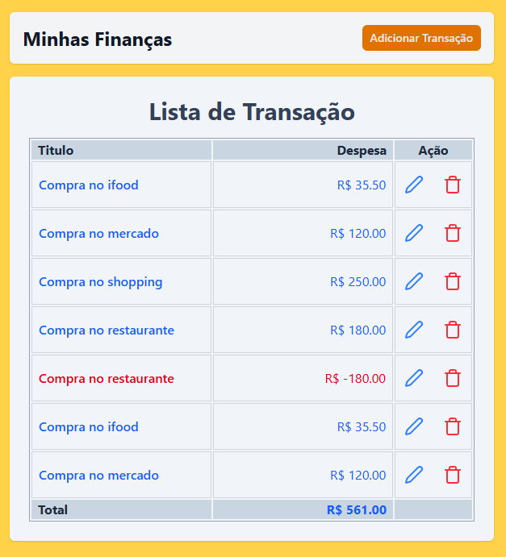
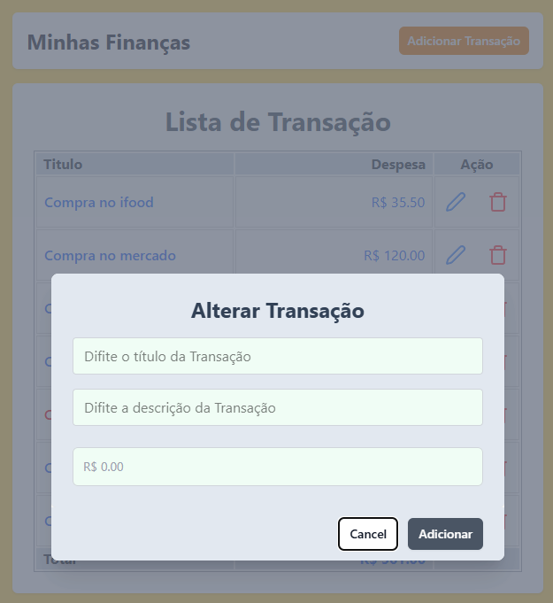
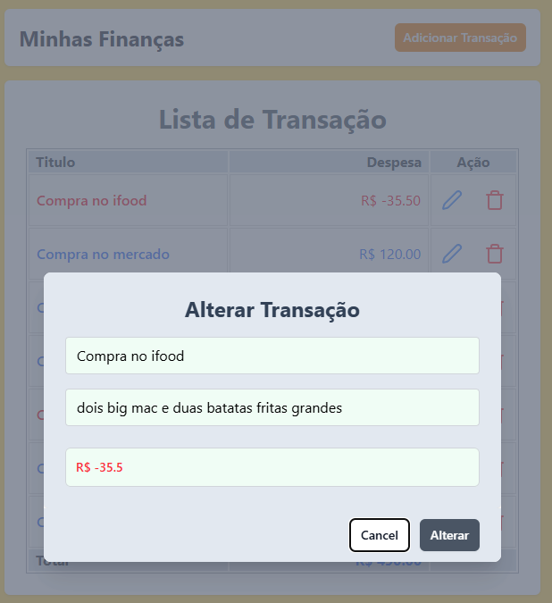

# 💸 Controle Financeiro em React

Este é um projeto de **controle financeiro** desenvolvido em **React**, utilizando dados mockados (sem backend). Foi criado com o objetivo de praticar conceitos fundamentais da biblioteca e melhorar as habilidades de estilização com **Tailwind CSS**.

## 💼 Deploy

<a href="https://react-project-5o8y-git-main-rafaelhuber-8764s-projects.vercel.app/">https://react-project-5o8y-git-main-rafaelhuber-8764s-projects.vercel.app/</a>

## 🚀 Funcionalidades

- **Adicionar transações**: Cadastro de transações com **título**, **descrição** e **valor**.
- **Listagem dinâmica**: Exibição das transações em uma lista, com **valores positivos em azul** (entradas) e **negativos em vermelho** (saídas).
- **Editar e remover**: Possibilidade de editar e excluir transações da lista.

## ⚙️ Tecnologias e conceitos

- **React**:
  - Componentes reutilizáveis
  - Props
  - Eventos
  - Listas e formulários
- **Hooks**:
  - `useState` para gerenciamento de estado
  - `useEffect` para lidar com efeitos colaterais
- **Tailwind CSS**:
  - Estilização com classes utilitárias
  - Layout responsivo e organizado

## 🎯 Objetivo

Treinar a estrutura de aplicações React, explorando os principais conceitos da biblioteca em um contexto prático de CRUD local, sem integração com servidor.

---

## 📸 Screenshots

### 📋 Lista de Transações

### 📝 Formulário de Cadastro

### 📝 Formulário de Edição

